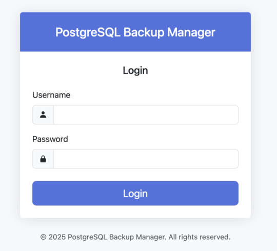
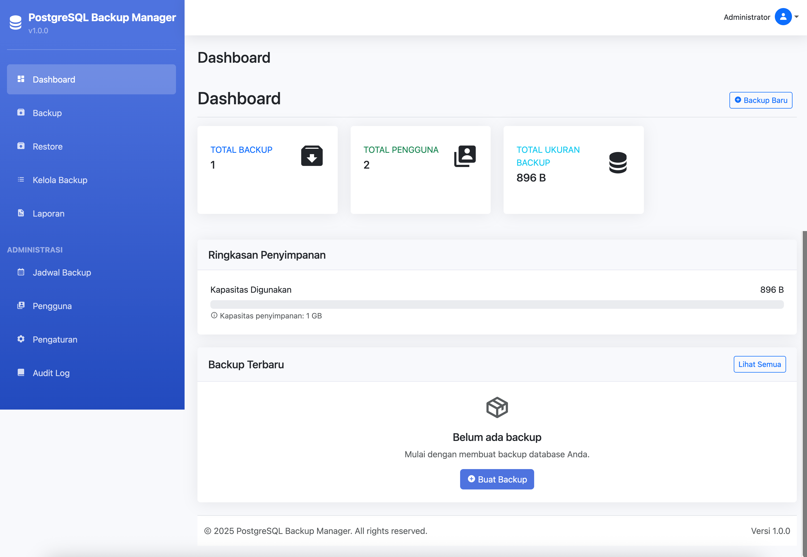
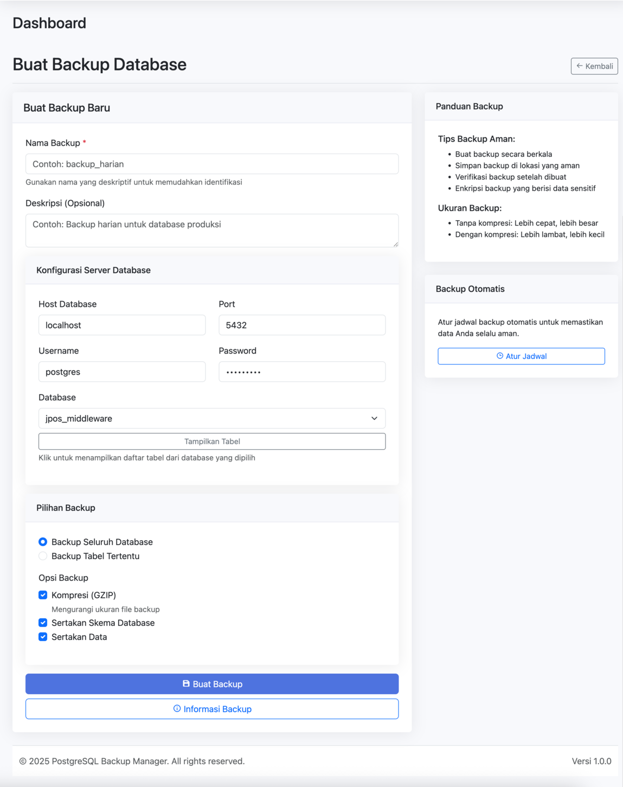
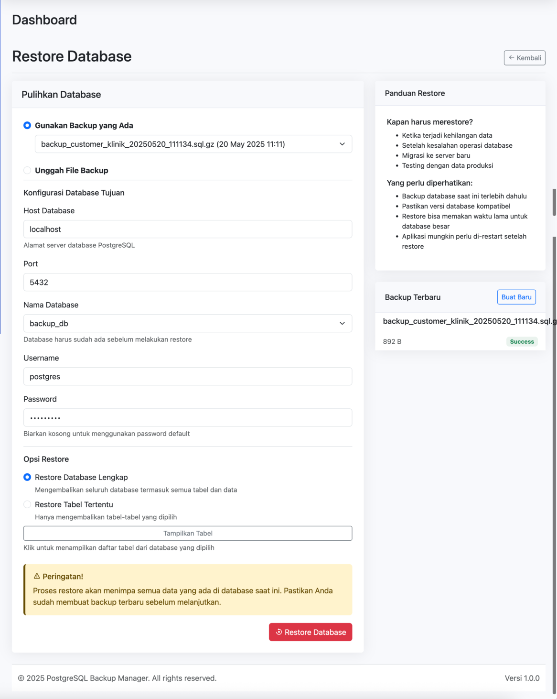
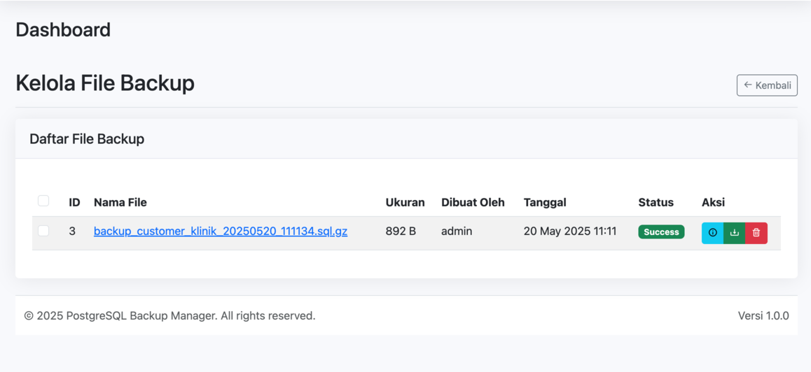
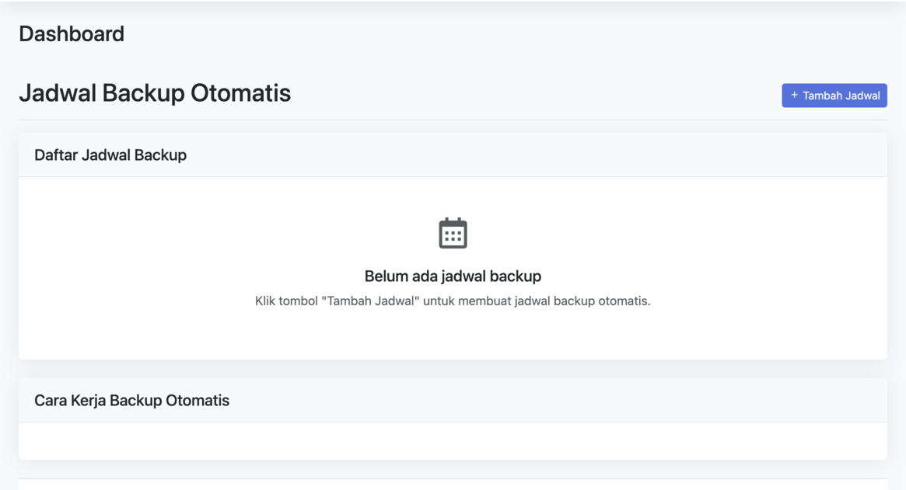
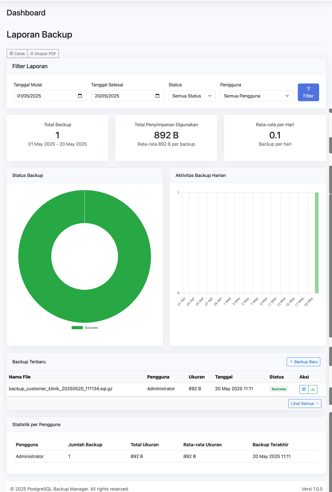
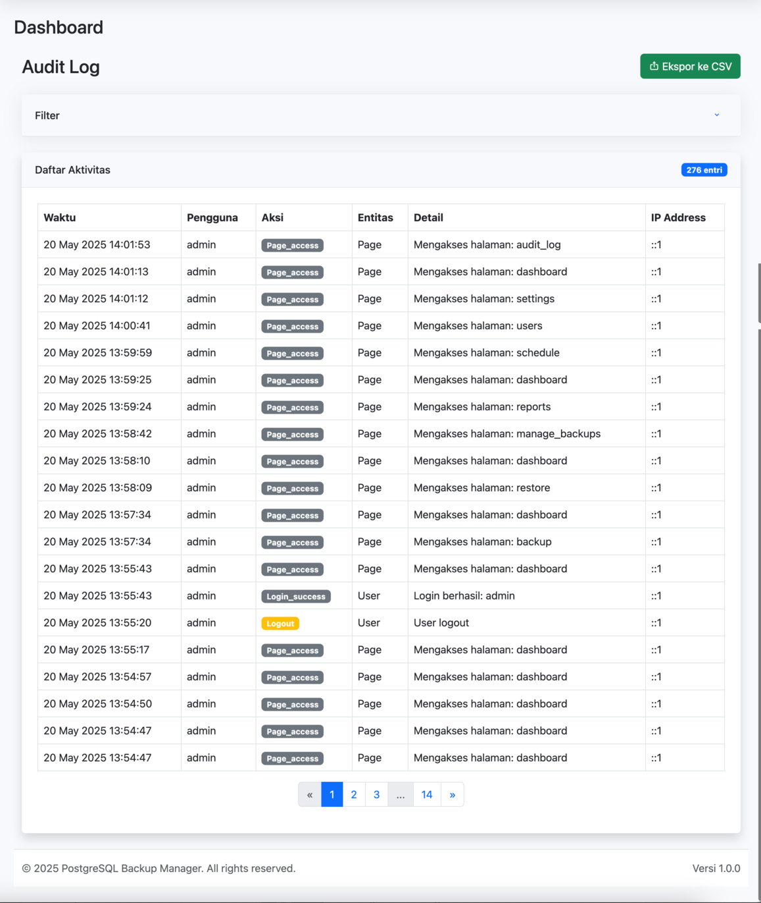
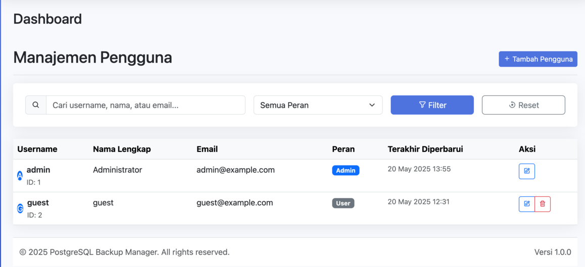
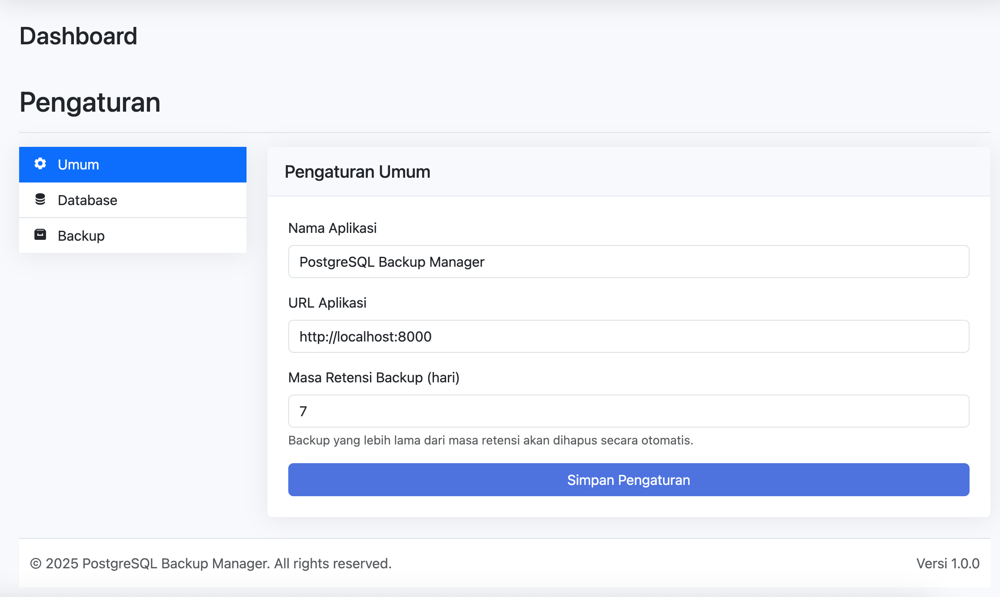

# PostgreSQL Backup Manager

Aplikasi berbasis web untuk melakukan backup dan restore database PostgreSQL dengan mudah. Dilengkapi dengan antarmuka yang user-friendly dan fitur manajemen backup yang lengkap.

## Fitur Utama

- Backup database PostgreSQL dengan berbagai opsi (full, schema, atau tabel tertentu)
- Restore database dari file backup
- Jadwal backup otomatis dengan cron job
- Manajemen retensi backup otomatis
- Antarmuka web yang responsif dan mudah digunakan
- Multi-user dengan sistem autentikasi
- Log aktivitas dan riwayat backup/restore
- Ekspor/import konfigurasi backup

## Screenshot Aplikasi

### Halaman Login


### Dashboard


### Halaman Backup


### Halaman Restore


### Halaman Kelola Backup


### Halaman Jadwal Backup


### Halaman Laporan


### Halaman Audit Log


### Halaman Pengguna


### Halaman Pengaturan


## Persyaratan Sistem

- PHP 7.4 atau lebih baru
- PostgreSQL 10 atau lebih baru
- Web server (Apache/Nginx) dengan PHP
- Akses ke command line (untuk cron job)
- Ekstensi PHP yang diperlukan: pdo_pgsql, pgsql, json, mbstring

## Struktur Folder

```
backup_postgre/
├── assets/           # File aset (CSS, JS, gambar)
├── backups/          # File backup disimpan di sini
├── config/           # File konfigurasi
├── controllers/      # Controller aplikasi
├── handlers/         # Handler untuk permintaan AJAX
├── includes/         # File include dan library
├── logs/             # File log
│   ├── ajax/         # Log untuk permintaan AJAX
│   ├── backup/       # Log untuk proses backup
│   ├── cron/         # Log untuk cron job
│   ├── delete/       # Log untuk proses penghapusan
│   ├── download/     # Log untuk proses download
│   └── restore/      # Log untuk proses restore
├── pages/            # Halaman web
├── scripts/          # Script CLI
└── tmp/              # File sementara
```

## Instalasi

### 1. Clone Repository

```bash
git clone https://github.com/adhinugroho1711/postgree-backup-manager.git
cd postgree-backup-manager
```

### 2. Konfigurasi Web Server

#### Apache

Pastikan modul `mod_rewrite` diaktifkan dan tambahkan konfigurasi berikut di file `.htaccess`:

```apache
<IfModule mod_rewrite.c>
    RewriteEngine On
    RewriteBase /
    
    # Jika file atau direktori ada, gunakan langsung
    RewriteCond %{REQUEST_FILENAME} !-f
    RewriteCond %{REQUEST_FILENAME} !-d
    
    # Arahkan semua permintaan ke index.php
    RewriteRule ^(.*)$ index.php?url=$1 [QSA,L]
</IfModule>
```

#### Nginx

Tambahkan konfigurasi berikut di blok server:

```nginx
server {
    # ... konfigurasi lainnya ...
    
    location / {
        try_files $uri $uri/ /index.php?$args;
    }
    
    location ~ \.php$ {
        include fastcgi_params;
        fastcgi_pass unix:/var/run/php/php8.1-fpm.sock;  # Sesuaikan versi PHP
        fastcgi_index index.php;
        fastcgi_param SCRIPT_FILENAME $document_root$fastcgi_script_name;
    }
}
```

### 3. Konfigurasi Database

1. Buat database baru di PostgreSQL:
   ```sql
   CREATE DATABASE postgres_backup_manager;
   ```

2. Import skema database dari file `schema.sql`:
   ```bash
   psql -U postgres -d postgres_backup_manager -f schema.sql
   ```

3. Konfigurasi koneksi database di file `config/database.php`:
   ```php
   // Ubah parameter koneksi sesuai dengan konfigurasi PostgreSQL Anda
   $db_host = 'localhost';
   $db_port = '5432';
   $db_name = 'postgres_backup_manager';
   $db_user = 'postgres';
   $db_password = 'password_anda';
   ```

### 4. Konfigurasi Aplikasi

1. Salin file `config/config.sample.php` ke `config/config.php`:
   ```bash
   cp config/config.sample.php config/config.php
   ```

2. Edit file `config/config.php` sesuai kebutuhan:
   ```php
   // Konfigurasi aplikasi
   define('APP_NAME', 'PostgreSQL Backup Manager');
   define('APP_VERSION', '1.0.0');
   define('BASE_URL', 'http://localhost/postgree-backup-manager'); // Sesuaikan dengan URL aplikasi Anda
   
   // Path untuk menyimpan file backup
   define('BACKUP_DIR', __DIR__ . '/../backups');
   
   // Konfigurasi PostgreSQL path
   define('PG_DUMP_PATH', '/usr/bin/pg_dump'); // Sesuaikan dengan path pg_dump di sistem Anda
   define('PG_RESTORE_PATH', '/usr/bin/pg_restore'); // Sesuaikan dengan path pg_restore di sistem Anda
   ```

### 5. Pengaturan Hak Akses

1. Pastikan direktori `backups` dan `logs` dapat ditulis oleh web server:
   ```bash
   chmod -R 755 backups logs
   chown -R www-data:www-data backups logs  # Sesuaikan dengan user web server Anda
   ```

2. Pastikan file konfigurasi aman:
   ```bash
   chmod 640 config/config.php config/database.php
   ```

### 6. Akses Aplikasi

1. Buka aplikasi di browser sesuai dengan konfigurasi web server Anda

## Troubleshooting

### Masalah Umum

1. **Error koneksi database**
   - Pastikan PostgreSQL berjalan
   - Periksa kredensial di file konfigurasi
   - Pastikan user database memiliki hak akses yang cukup

2. **Error saat backup/restore**
   - Pastikan path pg_dump dan pg_restore benar
   - Periksa hak akses direktori backup
   - Periksa log untuk detail error

3. **File CSV tidak terunduh dengan benar**
   - Pastikan tidak ada output HTML sebelum header CSV
   - Periksa pengaturan browser untuk unduhan file

### Mendapatkan Bantuan

Jika Anda mengalami masalah, silakan buat issue di GitHub repository.

## Penggunaan

### Fitur Backup

1. Login ke aplikasi
2. Pilih menu "Backup"
3. Pilih database yang akan di-backup
4. Pilih opsi backup (full, schema, atau tabel tertentu)
5. Klik tombol "Backup Sekarang"

### Fitur Restore

1. Login ke aplikasi
2. Pilih menu "Restore"
3. Pilih file backup yang akan di-restore
4. Pilih opsi restore
5. Klik tombol "Restore Sekarang"

### Fitur Audit Log

1. Login ke aplikasi
2. Pilih menu "Audit Log"
3. Lihat riwayat aktivitas pengguna
4. Gunakan filter untuk menyaring data
5. Klik tombol "Ekspor ke CSV" untuk mengunduh data dalam format CSV

### Setup Cron Job (Opsional)

Untuk menjalankan backup otomatis, tambahkan baris berikut ke crontab:

```bash
# Edit crontab
crontab -e

# Tambahkan baris berikut (sesuaikan path)
0 2 * * * php /path/ke/postgree-backup-manager/scripts/cron_backup.php > /dev/null 2>&1
```

## Kontribusi

Kontribusi selalu diterima dengan senang hati. Silakan buat pull request atau laporkan issue di GitHub.

## Lisensi

Aplikasi ini dilisensikan di bawah [MIT License](LICENSE).

2. Login dengan kredensial default:
   - Username: admin
   - Password: admin123

   **Segera ganti password setelah login pertama kali!**

## Struktur Log

Aplikasi ini menghasilkan beberapa jenis log yang disimpan di folder `logs/`:

- `ajax/` - Log untuk permintaan AJAX
- `backup/` - Log untuk proses backup
- `cron/` - Log untuk cron job
- `delete/` - Log untuk proses penghapusan
- `download/` - Log untuk proses download
- `restore/` - Log untuk proses restore

## Keamanan

1. Selalu gunakan HTTPS
2. Batasi akses ke direktori `backups/` dan `logs/` melalui konfigurasi web server
2. Batasi akses ke folder `backups/` dan `logs/` melalui konfigurasi web server
3. Ganti password default setelah instalasi
4. Update aplikasi secara berkala
5. Backup database dan file konfigurasi secara teratur

## Troubleshooting

### Masalah Koneksi Database
- Pastikan layanan PostgreSQL berjalan
- Periksa kredensial database di file `.env`
- Pastikan user database memiliki hak akses yang cukup

### Masalah Izin
- Pastikan web server memiliki izin menulis ke folder `backups/`, `logs/`, dan `tmp/`
- Sesuaikan kepemilikan folder dengan user web server

### Masalah Cron Job
- Pastikan PHP CLI tersedia di PATH
- Periksa log cron di `/var/log/syslog` atau `/var/log/cron`
- Pastikan script memiliki izin eksekusi

## Kontribusi

1. Fork repository
2. Buat branch fitur (`git checkout -b fitur/namafitur`)
3. Commit perubahan (`git commit -am 'Menambahkan fitur'`)
4. Push ke branch (`git push origin fitur/namafitur`)
5. Buat Pull Request

## Lisensi

Proyek ini dilisensikan di bawah [MIT License](LICENSE).

## Lisensi

MIT License
